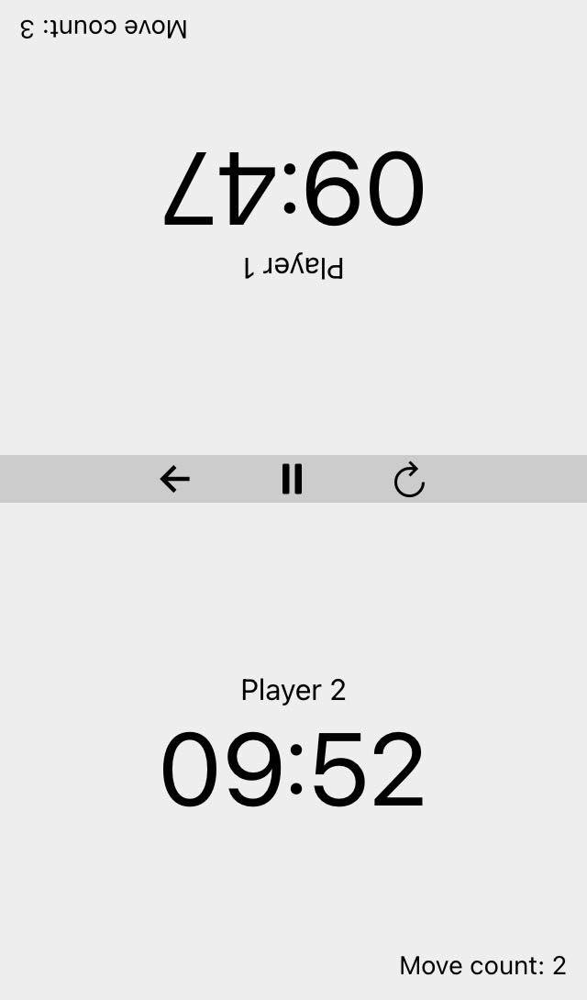

# Chess Timer created with React Native and Expo

This is a simple chess timer I created in order to get more familiar with native app development in React. It has support for custom player names and time control settings.
Tested on Web and iOS.

## Installation

1. Make sure you have expo installed


    ```bash
    yarn global add expo-cli

    # or

    npm install -g expo-cli 
    ```

2. Clone this repository

    ```bash
    git clone https://github.com/stefanbankow/typescript-chess-timer.git
    ```

3. Run `yarn install` or `expo install`
4. Run `yarn start` or `expo start`

## Showcase

### iOS

 </img>&nbsp;&nbsp;&nbsp;
 </img>


### Web
 </img>&nbsp;&nbsp;&nbsp;
 </img>